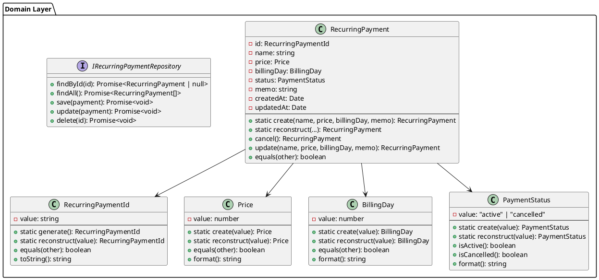

# プロジェクト概要

## 1. プロジェクト概要

### 1.1 試験の目的と埋めたい項目

**社内試験** のための小規模 CRUD アプリケーション開発。

#### 試験の目的
- ドメイン取得・運用スキルの習得
- インフラストラクチャ構築（EC2 + DB）の実践
- テスト駆動開発による品質確保

#### 試験で埋めたい項目
| 項目 | 詳細 |
|-----|------|
| **ドメイン取得** | 独自ドメイン取得、DNS 設定完了 |
| **デプロイ** | EC2 インスタンスへのアプリケーション配置、手動デプロイ実行可能 |
| **運用** | ログ管理、エラーハンドリング、DB バックアップ手順の実装 |
| **テストコード** | ユニット + 統合 + E2E テスト、カバレッジ C1 100% 達成 |

#### ただし、単なる提出物ではなく以下も同時に実現

1. ✅ **フロントエンド設計の実験**
   - DomainModel / InputModel の明確な分離
   - コンポーネント責務分割（I/O / 表示 / ロジック）
   - 実務的で再利用可能なアーキテクチャ

2. ✅ **チーム展開可能なプロトタイプ**
   - 設計思想を可視化したコードベース
   - チームプレゼン用の実装サンプル
   - 将来の個人開発テンプレート

---

### 1.2 アプリケーション

**定期支払い（サブスク）管理アプリケーション**

#### 対象
Netflix、ChatGPT、AWS など、月額で支払うサービスの管理

#### 主要機能

**登録・管理画面：**
- 定期支払いの新規登録
- 支払い情報の編集（料金、支払日、メモ）
- 支払いの削除（物理削除）

**閲覧画面（Dashboard）：**
- 登録済みの全定期支払い一覧表示
- サービス名、月額、支払日、ステータスを表示
- 利用中 / 解約済みの区別を視覚的に表示

#### ビジネスロジック

**ステータス遷移：**
```
active（利用中）
    ↓↑
cancelled（解約済）

- active → cancelled へ遷移可能（解約）
- cancelled → active へ遷移可能（再契約）
```

**制約条件：**
- 支払い日は 1～31 の整数
- 価格は 0 より大きい値
- サービス名は 1～100 文字

---

## 2. 技術スタック

### 2.1 フロントエンド

| 技術 | 用途 | バージョン |
|-----|------|----------|
| **Vue 3** | UI フレームワーク | 3.3+ |
| **TypeScript** | 型安全性 | 5.0+ |
| **Pinia** | ステート管理 | 2.1+ |
| **Vite** | ビルドツール | 5.0+ |
| **Vitest** | テストフレームワーク | 1.0+ |
| **@vue/test-utils** | コンポーネントテスト | 2.4+ |

**特徴：**
- Full TypeScript（フロント・バック統一）
- Zod で API 型安全性を保証
- DomainModel / InputModel で設計思想を実装

---

### 2.2 バックエンド

| 技術 | 用途 | バージョン |
|-----|------|----------|
| **Hono** | Web フレームワーク | 4.0+ |
| **TypeScript** | 型安全性 | 5.0+ |
| **Drizzle ORM** | ORM | 0.30+ |
| **SQLite** | データベース | - |
| **Zod** | バリデーション | 3.22+ |
| **Vitest** | テストフレームワーク | 1.0+ |

**特徴：**
- 軽量で Cloudflare Workers への移行を想定
- DDD（Domain-Driven Design）に基づくレイヤー分け
- Entity, ValueObject で不変条件を強制

---

### 2.3 共有

| 技術 | 用途 |
|-----|------|
| **Zod** | スキーマ定義（フロント・バック共有） |
| **npm workspaces** | モノレポ管理 |

**特徴：**
- Zod スキーマを `packages/shared` で一元管理
- フロント・バック で同じ型定義を使用
- 型の一貫性が保証される

---

## 3. アーキテクチャ全体図

```
┌─────────────────────────────────────────────────────────────┐
│                     Frontend (Vue 3 + TS)                   │
├─────────────────────────────────────────────────────────────┤
│                                                             │
│  Page Component (SubscriptionsPage.vue)                    │
│  ├─ Container (SubscriptionFormContainer.vue)             │
│  │  └─ I/O Components (FormInput.vue)                     │
│  ├─ Presentation (SubscriptionCard.vue)                   │
│  └─ Store (Pinia: useSubscriptionStore)                   │
│     └─ Domain Layer (Subscription, SubscriptionInput)     │
│                                                             │
└─────────────────────────────────────────────────────────────┘
                            │
                            │ HTTP (Zod)
                            │
┌─────────────────────────────────────────────────────────────┐
│                  Backend (Hono + Drizzle)                   │
├─────────────────────────────────────────────────────────────┤
│                                                             │
│  Presentation Layer (Hono Routes)                          │
│  ├─ Request Validation (Zod)                              │
│  └─ Response DTO (RecurringPaymentResponse)               │
│                                                             │
│  UseCase Layer                                             │
│  ├─ CreateRecurringPaymentUseCase                         │
│  ├─ UpdateRecurringPaymentUseCase                         │
│  ├─ CancelRecurringPaymentUseCase                         │
│  └─ Mapper (Domain ↔ DTO)                                 │
│                                                             │
│  Domain Layer (DDD)                                         │
│  ├─ Entity: RecurringPayment                              │
│  └─ ValueObjects:                                          │
│     ├─ RecurringPaymentId                                │
│     ├─ Price                                             │
│     ├─ BillingDay                                        │
│     └─ PaymentStatus                                     │
│                                                             │
│  Infrastructure Layer                                      │
│  ├─ Repository (RecurringPaymentRepository)              │
│  └─ Database (Drizzle + SQLite)                          │
│                                                             │
└─────────────────────────────────────────────────────────────┘
                            │
                            │ SQL
                            │
┌─────────────────────────────────────────────────────────────┐
│                    SQLite Database                          │
├─────────────────────────────────────────────────────────────┤
│                                                             │
│  recurring_payments                                         │
│  ├─ id (UUID)                                             │
│  ├─ name (string)                                         │
│  ├─ price (real)                                          │
│  ├─ billing_day (integer)                                 │
│  ├─ status (string: active / cancelled)                   │
│  ├─ memo (string)                                         │
│  ├─ created_at (datetime)                                 │
│  └─ updated_at (datetime)                                 │
│                                                             │
└─────────────────────────────────────────────────────────────┘

┌─────────────────────────────────────────────────────────────┐
│                   Shared (packages/shared)                  │
├─────────────────────────────────────────────────────────────┤
│                                                             │
│  Zod Schemas                                               │
│  ├─ CreateRecurringPaymentSchema                          │
│  ├─ UpdateRecurringPaymentSchema                          │
│  ├─ RecurringPaymentResponseSchema                        │
│  └─ （フロント・バック両方で使用）                      │
│                                                             │
└─────────────────────────────────────────────────────────────┘
```

---

### 3.1 Domain Layer クラス図（Backend）



---

## 4. 設計思想

### 4.1 Backend: DDD（Domain-Driven Design）

**レイヤー：**

```
Presentation Layer
    ↓
UseCase Layer
    ↓
Domain Layer (Entity, ValueObject)
    ↓
Infrastructure Layer (Repository, DB)
```

**特徴：**
- **Entity** → 正しい状態のみを許容
- **ValueObject** → 不変オブジェクト、ビジネスルールをカプセル化
- **Repository** → Entity の永続化を抽象化
- **UseCase** → ビジネスロジックの実行単位

**テスト戦略：**
- Domain Layer → ユニットテスト（不変条件）
- UseCase Layer → ユニット + Mock
- Infrastructure Layer → 統合テスト（実 DB）
- Presentation Layer → 統合テスト（API）

---

### 4.2 Frontend: DomainModel / InputModel 分離

**コア思想：**

> 入力途中は「壊れた状態」を許容し、  
> 送信時に初めて「正しい状態」に変換する

```
InputModel（入力途中：壊れた状態）
    ↓ Zod バリデーション
    ↓ Converter
DomainModel（正しい状態：信頼できる）
    ↓ API 送信
    ↓ バックエンド処理
永続化
```

**メリット：**
- ✅ フォーム検証がシンプル（各フィールドのエラー表示）
- ✅ API 送信時に型安全性が保証される
- ✅ DomainModel は常に「正しい」ので、予期しないバグが少ない
- ✅ バックエンドの ValueObject と責務が一貫している

---

### 4.3 Frontend: コンポーネント設計

あなたの思想に基づいて、コンポーネントは以下の 3 種類のみ：

#### **I/O コンポーネント**（入力 + 表示）

**入力コンポーネント：**
- `components/ui/FormInput.vue` など
- 単なる入力フォームの UI
- **契約：** `v-model` でのみデータを受け渡す
- **特徴：** 入力可能、ネストも可能

**表示コンポーネント（Output）：**
- `components/SubscriptionCard.vue` など
- データの表示専用
- **契約：** `props` でデータを受け取る、`emit` でイベント発火
- **特徴：** 表示のみ、クリックなどのイベントを親に通知

#### **取りまとめコンポーネント**（ロジック集約）
- `components/SubscriptionFormContainer.vue` など
- **責務：**
  - 入力コンポーネントに値を流し込む
  - 入力コンポーネントから `v-model` で値を受け取る
  - 表示コンポーネントからの `emit` イベントを受け取る
  - イベントの整形・取りまとめ
  - API 通信（または Pinia Store へのアクセス）
  - バリデーション実行
- **特徴：** ロジックが集約されている

#### **ページコンポーネント**
- `pages/SubscriptionsPage.vue` など
- ページ全体のコンポーネント
- Pinia Store とのインテグレーション

**図示：**

```
SubscriptionsPage.vue（ページ）
├─ SubscriptionFormContainer.vue（取りまとめ）
│   ├─ FormInput.vue（入力 I/O）
│   ├─ FormInput.vue（入力 I/O）
│   └─ FormInput.vue（入力 I/O）
└─ SubscriptionCard.vue（表示 I/O）
   ├─ emit: edit
   ├─ emit: delete
   └─ emit: cancel
```

**イベント管理の原則：**
- I/O コンポーネント（入力）側では **決して** イベント発火を試みない
- イベントの発火は、取りまとめコンポーネント側にまで持ち上げる（emit）
- 取りまとめコンポーネントでデータの整形・取りまとめを実行
- API 通信も取りまとめコンポーネント（または Pinia Store）で実行

---

## 5. ドキュメント構成

| # | ドキュメント | 内容 |
|---|-----------|------|
| **00** | Overview | このファイル。プロジェクト全体像 |
| **01** | Architecture | アーキテクチャの詳細（図解） |
| **02** | Domain Design | Backend DDD 設計（Entity, ValueObject, UseCase） |
| **03** | API Design | Hono API エンドポイント、Zod スキーマ |
| **04** | Frontend Design | Vue 3 設計（DomainModel, InputModel, コンポーネント） |
| **05** | Directory Structure | ディレクトリ構成、テスト計画（C1 100%） |
| **06** | Setup | 環境構築手順（後で作成） |

---

## 6. 試験要件との対応

### 試験項目：「ドメイン取得・デプロイ・運用」

#### ドメイン取得
- 独自ドメイン取得（別途）
- DNS 設定完了

#### デプロイ
- EC2 インスタンスにアプリケーション配置
- フロント（Vue build）とバック（Hono）を同じインスタンスで動作
- 手動デプロイ可能な構成

#### 運用
- ログ管理
- エラーハンドリング
- DB バックアップ手順

### 試験項目：「テストをちゃんと書く」

#### テスト戦略
- **ユニットテスト** → Domain Layer, ValueObject
- **統合テスト** → UseCase, API エンドポイント, コンポーネント
- **E2E テスト** → ページ操作（jsdom）

#### カバレッジ
- **目標：C1 100%**（全条件分岐をカバー）
- `vitest --coverage` で測定

---

## 8. 実装時の注意点

### Backend
- ✅ 必ず Entity の constructor で不変条件をチェック
- ✅ UseCase では必ず Repository Interface を使用（テストの Mock を想定）
- ✅ DTO は Request / Response で分ける
- ✅ エラーハンドリングは Hono のグローバルハンドラで統一

### Frontend
- ✅ InputModel は「壊れた状態」を許容
- ✅ DomainModel は常に「正しい状態」のみ
- ✅ I/O コンポーネントは pure（v-model のみ）
- ✅ ロジックは Container コンポーネントまたは Store に集約
- ✅ Zod で検証後、DomainModel に変換

### 共有
- ✅ Zod スキーマは `packages/shared` に配置
- ✅ フロント・バック両方で import して使用
- ✅ スキーマ変更は両方に影響することを意識

---

## 9. チームプレゼン用ポイント

このアプリケーションで説明できること：

1. **DDD の実装例**
   - Entity, ValueObject の責務分離
   - UseCase パターン
   - Repository パターン

2. **フロントエンド設計の工夫**
   - DomainModel / InputModel の分離
   - コンポーネント責務分割
   - API 型安全性（Zod）

3. **Full TypeScript の実践**
   - フロント・バック同じ言語
   - スキーマ共有による型一貫性

4. **テスト駆動開発**
   - 各レイヤーのテスト戦略
   - カバレッジ 100%

5. **モノレポの運用**
   - npm workspaces による一元管理
   - 関連プロジェクト間の型共有

---

## 10. まとめ

このプロジェクトは、**試験要件を満たしながら、実務的で展開可能な設計を実装する** という、二つの目的を同時に実現します。

- ✅ 試験：ドメイン・デプロイ・運用・テスト
- ✅ 設計：DDD + フロントエンド思想 + Full TypeScript

**設計がしっかりしているので、実装は「設計を形にする」だけ。** テスト駆動で進めば、バグも少なく、カバレッジ 100% も無理なく達成できます。

🚀 では、次は環境構築フェーズへ！
