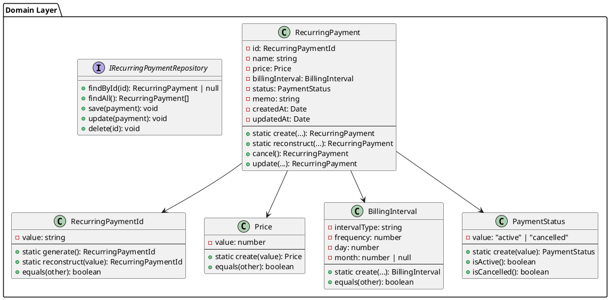
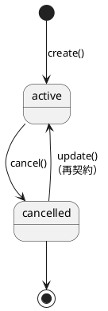
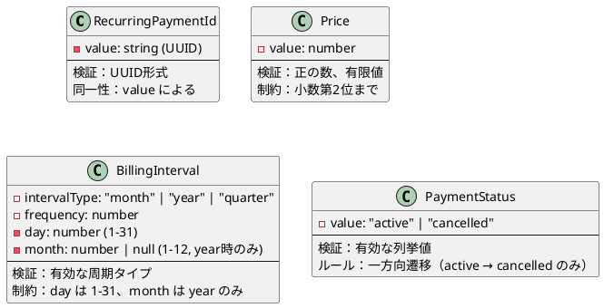
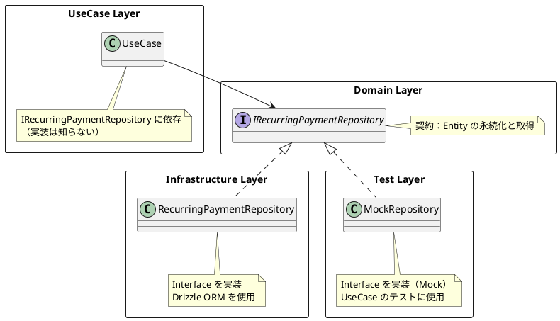
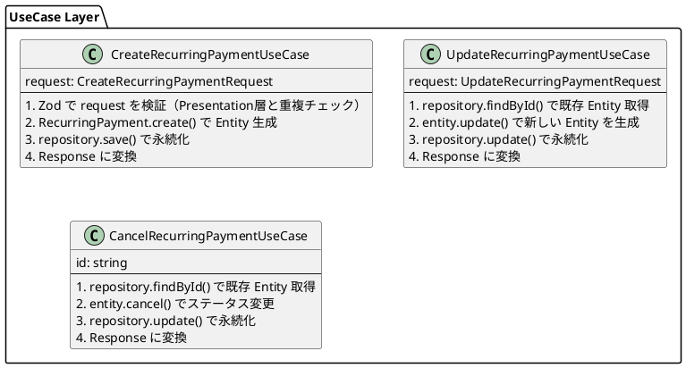
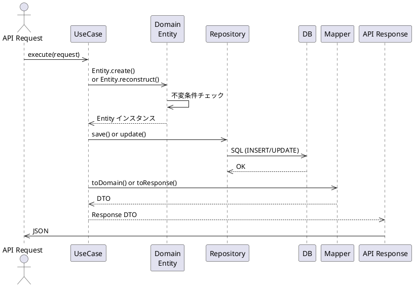
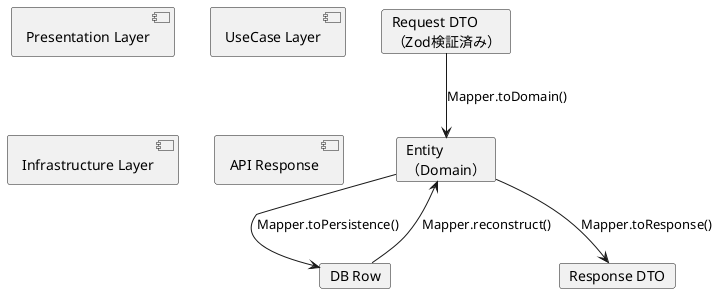
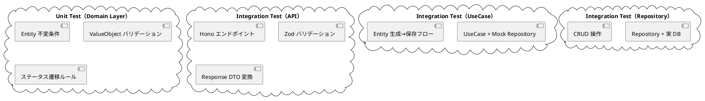
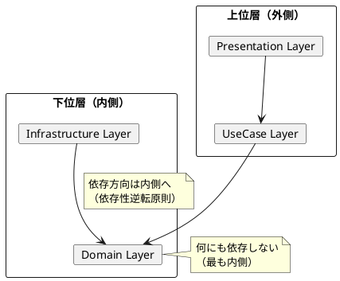

# Backend DDD 設計

## 概要

このドキュメントは、`RecurringPayment` エンティティを中心とした Backend の Domain Layer 設計を定義します。

**アーキテクチャ：**
```
Presentation Layer (Hono Routes)
    ↓
UseCase Layer (Business Logic)
    ↓
Domain Layer (Entity, ValueObject)
    ↓
Infrastructure Layer (Repository, DB)
```

---

## 1. Domain Layer アーキテクチャ

### 1.1 全体構成図



---

## 2. Entity: RecurringPayment

### 2.1 責務

**RecurringPayment Entity は、定期支払いの「正しい状態」のみを表現します。**

- ✅ ビジネスルールを強制
- ✅ 不変条件を保証
- ✅ ステータス遷移ルールを実装

### 2.2 属性と不変条件

| 属性 | 型 | 制約 |
|-----|-----|------|
| `id` | `RecurringPaymentId` | UUID、ユニーク、不変 |
| `name` | `string` | 1～100文字、空白不可 |
| `price` | `Price` | ValueObject、正の数 |
| `billingInterval` | `BillingInterval` | ValueObject、支払い周期 |
| `status` | `PaymentStatus` | ValueObject、active \| cancelled |
| `memo` | `string` | 最大500文字 |
| `createdAt` | `Date` | 作成日時、不変 |
| `updatedAt` | `Date` | 更新日時、自動更新 |

### 2.3 主要メソッド

| メソッド | 説明 | 用途 |
|---------|------|------|
| `create()` | 新しい Entity を生成 | 新規作成時（UseCase） |
| `reconstruct()` | DB から復元 | Repository から取得時 |
| `update()` | 編集内容を反映（新しいインスタンスを返す） | 更新時（UseCase） |
| `cancel()` | ステータスを cancelled に変更 | 解約時（UseCase） |

### 2.4 ステータス遷移



---

## 3. ValueObject

### 3.1 特性

ValueObject は以下の特性を持つ：

- **不変オブジェクト** → 一度生成されたら変更不可
- **値による同一性** → 同じ値なら同じ
- **自己検証** → 生成時に不変条件をチェック
- **ビジネスルールをカプセル化** → ドメイン知識を含む

---

### 3.2 各 ValueObject の役割



**各 ValueObject の設計：**

1. **RecurringPaymentId**
   - UUID を表現
   - Entity の一意な識別子
   - Repository との連携で string に変換

2. **Price**
   - 周期料金を表現
   - 正の数チェック
   - 金額表示用の format() メソッド

3. **BillingInterval** ✨ **支払い周期を統合**
   - `intervalType`：月・年・四半期
   - `frequency`：何ヶ月ごと、何年ごとか
   - `day`：月の何日か（1-31）
   - `month`：年の場合のみ何月か（1-12）
   - 例：毎月15日 → `{ intervalType: "month", frequency: 1, day: 15, month: null }`
   - 例：毎年1月15日 → `{ intervalType: "year", frequency: 1, day: 15, month: 1 }`

4. **PaymentStatus**
   - ステータスを型安全に表現
   - active, cancelled のみ有効
   - ステータス判定メソッド（isActive, isCancelled）

---

## 4. Repository Pattern

### 4.1 Repository の役割



### 4.2 Repository Interface

```
+findById(id: RecurringPaymentId): Promise<RecurringPayment | null>
  └─ 指定 ID のエンティティを取得、存在しない場合は null

+findAll(): Promise<RecurringPayment[]>
  └─ 全エンティティを取得

+save(payment: RecurringPayment): Promise<void>
  └─ 新規エンティティを保存

+update(payment: RecurringPayment): Promise<void>
  └─ 既存エンティティを更新

+delete(id: RecurringPaymentId): Promise<void>
  └─ エンティティを削除
```

---

## 5. UseCase Layer

### 5.1 UseCase の役割



### 5.2 UseCase フロー



---

## 6. データベーススキーマ

### 6.1 テーブル構造

```
テーブル名：recurring_payments

カラム                   型              制約
─────────────────────────────────────────────
id                   TEXT             PRIMARY KEY (UUID)
name                 TEXT             NOT NULL
price                REAL             NOT NULL
billing_interval_type    TEXT         NOT NULL
                                      （'month', 'year', 'quarter'）
billing_frequency    INTEGER          NOT NULL
billing_day          INTEGER          NOT NULL
billing_month        INTEGER          （year の場合のみ）
status               TEXT             NOT NULL
memo                 TEXT             DEFAULT ''
created_at           TEXT             NOT NULL (ISO 8601)
updated_at           TEXT             NOT NULL (ISO 8601)
```

**BillingInterval のマッピング：**
- `billing_interval_type`: "month" | "year" | "quarter"
- `billing_frequency`: 1, 2, 3...（1ヶ月ごと、2ヶ月ごと）
- `billing_day`: 1-31（月の何日か）
- `billing_month`: 1-12（年払いの場合のみ何月か）

**例：**
- 毎月15日：type=month, frequency=1, day=15, month=NULL
- 3ヶ月ごと20日：type=month, frequency=3, day=20, month=NULL
- 毎年1月15日：type=year, frequency=1, day=15, month=1

### 6.2 Entity ↔ DB マッピング

```plantuml
@startuml EntityMapping

rectangle "Domain Layer" {
    class RecurringPayment {
        id: RecurringPaymentId
        name: string
        price: Price
        billingInterval: BillingInterval
        status: PaymentStatus
        memo: string
        createdAt: Date
        updatedAt: Date
    }
    note right of RecurringPayment
        TypeScript オブジェクト
        ビジネスロジック含む
        不変条件を強制
    end note
}

database "recurring_payments" {
    id (TEXT)
    name (TEXT)
    price (REAL)
    billing_interval_type (TEXT)
    billing_frequency (INTEGER)
    billing_day (INTEGER)
    billing_month (INTEGER)
    status (TEXT)
    memo (TEXT)
    created_at (TEXT)
    updated_at (TEXT)
}

note right of recurring_payments
    SQL テーブル
    スカラー値のみ
    Mapper で相互変換
end note

@enduml
```

---

## 7. Mapper（DTO ↔ Domain）

### 7.1 マッピングの責務

| 変換方向 | 入力 | 出力 | 用途 |
|---------|------|------|------|
| **Request → Domain** | Request DTO | Entity | API リクエスト受付 |
| **Domain → Response** | Entity | Response DTO | API レスポンス |
| **Domain → Persistence** | Entity | DB Row | DB 保存 |
| **Persistence → Domain** | DB Row | Entity | DB から取得 |

### 7.2 マッピングフロー



---

## 8. 次回の支払い日の計算

### 8.1 設計方針

**「次回の支払い日」は Entity に持たない。** 代わりに UseCase で計算します。

**理由：**
- ✅ 支払い日は「計算可能」な値（Entity の属性から導出可能）
- ✅ Entity に持つと、毎日更新が必要になる
- ✅ DDD の原則上、Entity は「状態」のみ保持、計算は外側で

### 8.2 計算ロジック（UseCase）

```
NextBillingDateCalculator

入力：
  ├─ currentDate: Date（現在の日付）
  ├─ billingDay: BillingDay（何日に支払うか）
  └─ billingInterval: BillingInterval（月ごと・年ごと）

出力：
  └─ nextBillingDate: Date（次の支払い日）

ロジック例：

【毎月支払い】
  現在：2024-01-20
  billingDay: 15
  nextBillingDate: 2024-02-15

【3ヶ月ごと】
  現在：2024-01-20
  billingDay: 15
  nextBillingDate: 2024-04-15

【年1回支払い】
  現在：2024-01-20
  billingDay: 15
  nextBillingDate: 2025-01-15
```

### 8.3 API レスポンスに含める

```json
{
  "id": "uuid",
  "name": "Netflix",
  "price": 1490,
  "billingInterval": {
    "intervalType": "month",
    "intervalCount": 1
  },
  "billingDay": 15,
  "status": "active",
  "createdAt": "2024-01-01T00:00:00Z",
  "updatedAt": "2024-01-01T00:00:00Z",
  "nextBillingDate": "2024-02-15"  ← UseCase で計算
}
```

---

## 9. テスト戦略

### 8.1 テスト階層



### 8.2 Domain Layer テスト例

**Entity テスト対象：**
- ✅ `create()` で正しく Entity が生成される
- ✅ 不正なデータで例外が throw される
- ✅ `cancel()` で cancelled に遷移
- ✅ 既に cancelled なら cancel() で例外
- ✅ `update()` で新しい Entity を返す
- ✅ `equals()` で同一性を判定

**ValueObject テスト対象：**
- ✅ Price: 正の数で生成、0 以下で例外
- ✅ Price: 小数第2位に丸められる
- ✅ BillingDay: 1～31 で生成、範囲外で例外
- ✅ PaymentStatus: active/cancelled のみ有効
- ✅ PaymentStatus: isActive(), isCancelled() が正しく判定

---

## 10. アーキテクチャレイヤーの詳細

### 10.1 依存関係の方向



**原則：**
- Domain Layer は何にも依存しない（最も内側）
- UseCase Layer は Domain に依存
- Presentation Layer は UseCase に依存
- Infrastructure Layer は Domain の Interface を実装

### 9.2 テスト容易性

```
UseCase のテスト
  ↓
Repository Interface に Mock を注入
  ↓
Domain Layer は変更なし
  ↓
UseCase のビジネスロジックのみテスト可能
```

---

## 10. 実装時のチェックリスト

### Entity 実装時

- [ ] constructor を private にする（Factory メソッドを使う）
- [ ] create() Factory で不変条件をチェック
- [ ] reconstruct() Factory で DB から復元
- [ ] update(), cancel() は新しいインスタンスを返す（不変性）
- [ ] 全フィールドを readonly にする

### ValueObject 実装時

- [ ] constructor を private にする
- [ ] static create() で検証を実施
- [ ] static reconstruct() で DB から復元
- [ ] equals() メソッドを実装
- [ ] toString() または format() メソッドを実装
- [ ] 全フィールドを readonly にする

### Repository 実装時

- [ ] Interface を Domain Layer で定義
- [ ] Infrastructure Layer で実装
- [ ] 非同期メソッド（async）で実装
- [ ] Entity の Mapper を内部で実行
- [ ] テストは Mock を使用

---

## 11. まとめ

### Domain Layer の設計メリット

| 側面 | メリット |
|-----|---------|
| **正確性** | Entity が不変条件を強制 |
| **保守性** | 責務が明確に分離 |
| **テスト容易性** | Mock 可能な Repository パターン |
| **拡張性** | UseCase 追加時に Domain は変更不要 |
| **型安全性** | ValueObject で制約を表現 |

### 次のフェーズ

設計後、以下を実装：
1. ✅ Domain Layer（Entity, ValueObject, Repository Interface）
2. ✅ UseCase Layer（ビジネスロジック）
3. ✅ Infrastructure Layer（Repository 実装、DB）
4. ✅ Presentation Layer（Hono Routes、Zod バリデーション）
